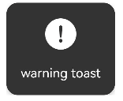

# XTHUD
## 1. 简介
- 基于ArkUI封装的通用型 LoadingHUD、ToastHUD、ProgressHUD 组件库
- 适配 API11
- HUD 组件基于 CustomDialogController 定制开发，兼容了物理返回事件导致的 Dialog 关闭问题
- HUD 支持多种默认样式，样式支持高度自定义
- HUD 支持响应式更新自定义样式和 text，且不会重复创建 Dialog 实例
- 单类型 HUD 为全局唯一 Dialog 实例，避免重复创建导致的内存消耗问题，避免叠加显示和切换显示闪烁问题
- ToastHUD 除了支持常规模式，还支持队列弹出模式
- LoadingHUD 支持 ArkUI 的 LoadingProgress 样式，支持自定义加载样式，支持 SVG 动效
- ProgressHUD 基于 Progress 组件做了逻辑封装
- 整体 API 简单易用

## 2. 下载安装
```
ohpm install @jxt/xt_hud
```

## 3. 部分样式展示
HUD 均有默认样式，也均支持自定义样式，且 Loading 和 Progress 的 text 可以不显示。

| HUD类型                               | 预览效果                                     |
|-------------------------------------|------------------------------------------|
| text toast                          |        |
| info toast                          |      |
| warning toast                       |      |
| success toast                       |        |
| error toast                         |        |
| harmony loading + text              |    |
| ring loading + text                 |  |
| custom svg loading                  |  |
| custom svg loading                  |  |
| progress ring without text          |  |
| progress ring + text + custom style |  |
| progress bar + text + custom style  |  |

## 4. API 文档
### 4.1. 配置项
```typescript
/// HUD默认配置，不支持动态响应，仅支持在组件初始化阶段设置
export interface XTHUDBaseOptions {
  /// HUD竖直方向上的显示位置，默认值DialogAlignment.Center
  alignment?: DialogAlignment
  /// HUD相对alignment所在位置的偏移量，默认值{ dx: 0, dy: 0 }
  offset?: Offset
  /// 遮罩颜色，默认值 Color.Transparent，仅isModal==true时有效
  maskColor?: ResourceColor
  /// 开启动画，默认值为空，不设置
  openAnimation?: AnimateParam
  /// 关闭动画，默认值为空，不设置
  closeAnimation?: AnimateParam
  /// 是否为全屏，屏蔽交互，根据HUD类型区分，toast默认false，其他默认true
  isModal?: boolean
}
/// HUD响应配置，支持后续动态更新
export interface XTHUDReactiveOptions extends XTHUDBaseOptions {
  /// 文本字体
  fontSize?: number | string | Resource
  /// 文本颜色，默认white
  textColor?: ResourceColor
  /// 主题颜色（toast/loading图标等），默认white
  tintColor?: ResourceColor
  /// HUD背景色，默认值 #CC000000
  backgroundColor?: ResourceColor
  /// HUD圆角，默认值10
  borderRadius?: Length | BorderRadiuses
  /// HUD结束回调
  completionCallback?: XTHUDCallback
  /// HUD取消回调，点击物理返回键，会触发提前关闭，该回调与completionCallback互斥，处理处理
  cancelCallback?: XTHUDCallback
}
/// Toast配置
export interface XTHUDToastOptions extends XTHUDReactiveOptions {
  /// 自定义图标
  iconSrc?: PixelMap | ResourceStr | DrawableDescriptor | null
  iconSize?: SizeOptions
  /// toast自动关闭时间间隔，默认值 2000ms
  hidingDelay?: number
  /// toast队列显示模式，一个个显示，直到结束，默认false，同时只显示一个
  /// 注意队列模式的toast不支持和其他非队列模式的toast混合使用，会被覆盖
  isQueueMode?: boolean
}

/// Loading配置
export interface XTHUDLoadingOptions extends XTHUDReactiveOptions {
  /// 自定义loading图标，建议使用svg动效
  iconSrc?: PixelMap | ResourceStr | DrawableDescriptor | null
  /// loading图标尺寸
  iconSize?: SizeOptions
  /// 环形loading的环宽度，其他样式设置无效
  strokeWidth?: Length
}

/// Progress配置
export interface XTHUDProgressOptions extends XTHUDReactiveOptions {
  /// 进度字体
  progressFontSize?: number | string | Resource
  /// progress图标尺寸
  iconSize?: SizeOptions
  /// bar和ring宽度
  strokeWidth?: Length
  /// 扫描动画效果
  enableScanEffect?: boolean
}
```

### 4.2. HUD 组件
```typescript
// XTHUDToast，可选配置全局默认样式
@Component
export struct XTHUDToast {
  // 自定义全局配置项回调函数
  globalOptions? : ((options: XTHUDToastOptions) => void) | null = null
}

// XTHUDLoading，可选配置全局默认样式
@Component
export struct XTHUDLoading {
  // 自定义全局配置项回调函数
  globalOptions? : ((options: XTHUDLoadingOptions) => void) | null = null
}

// XTHUDProgress，可选配置全局默认样式
@Component
export struct XTHUDProgress {
  // 自定义全局配置项回调函数
  globalOptions? : ((options: XTHUDProgressOptions) => void) | null = null
}
```

### 4.3. HUD 管理类
```typescript
export class XTHUDManager {
  /**
   * Toast，默认不屏蔽用户交互
   * 常规纯文本toast，自定义图标需要实现options.iconSrc
   *
   * @param { string } text 显示文本，必填，不能为空串
   * @param { XTHUDToastOptions? } options 可选自定义样式
   */
  static showToast(text: string, options?: XTHUDToastOptions): void
  /**
   * Toast，默认不屏蔽用户交互
   * 带info图标的文本toast
   *
   * @param { string } text 显示文本，必填，不能为空串
   * @param { XTHUDToastOptions? } options 可选自定义样式
   */
  static showInfo(text: string, options?: XTHUDToastOptions): void
  /**
   * Toast，默认不屏蔽用户交互
   * 带warning图标的文本toast
   *
   * @param { string } text 显示文本，必填，不能为空串
   * @param { XTHUDToastOptions? } options 可选自定义样式
   */
  static showWarning(text: string, options?: XTHUDToastOptions): void
  /**
   * Toast，默认不屏蔽用户交互
   * 带success图标的文本toast
   *
   * @param { string } text 显示文本，必填，不能为空串
   * @param { XTHUDToastOptions? } options 可选自定义样式
   */
  static showSuccess(text: string, options?: XTHUDToastOptions): void
  /**
   * Toast，默认不屏蔽用户交互
   * 带error图标的文本toast
   *
   * @param { string } text 显示文本，必填，不能为空串
   * @param { XTHUDToastOptions? } options 可选自定义样式
   */
  static showError(text: string, options?: XTHUDToastOptions): void
  /**
   * 隐藏一个toast，toast默认自动隐藏，如有需求可用hide方法提前关闭
   */
  static hideToast(): void
  /**
   * 隐藏全部toast，如果同时触发多个toast，可用这个全部关闭
   */
  static hideAllToast(): void

  /**
   * Loading，默认屏蔽用户交互
   * 默认样式loading，使用了鸿蒙默认的loading样式，也就是原生LoadingProgress组件
   *
   * @param { string? } text 显示文本，可选
   * @param { XTHUDLoadingOptions? } options 可选自定义样式
   */
  static showLoading(text?: string, options?: XTHUDLoadingOptions): void
  /**
   * Loading，默认屏蔽用户交互
   * 圆环样式loading，使用了鸿蒙原生Progress组件的LOADING样式
   *
   * @param { string? } text 显示文本，可选
   * @param { XTHUDLoadingOptions? } options 可选自定义样式
   */
  static showRingLoading(text?: string, options?: XTHUDLoadingOptions): void
  /**
   * Loading，默认屏蔽用户交互
   * 自定义样式loading，建议使用svg动效图标资源，具体参考Demo
   *
   * @param { PixelMap | ResourceStr | DrawableDescriptor } iconSrc 图标资源，建议使用svg动效图标资源
   * @param { string? } text 显示文本，可选
   * @param { XTHUDLoadingOptions? } options 可选自定义样式
   */
  static showCustomLoading(iconSrc: PixelMap | ResourceStr | DrawableDescriptor, text?: string, options?: XTHUDLoadingOptions): void
  /**
   * 隐藏一次loading，在并发请求中，如果需要loading去屏蔽用户交互，可能会有多次触发loading的情况
   * 内部维护了一个计数器，所以重复执行show方法并不会重复创建loading组件，可以避免资源消耗和loading显示冲突问题
   */
  static hideLoading(): void
  /**
   * 隐藏全部loading，可以在并发请求结束后，一次执行关闭所有的loading（计数器清零）
   */
  static hideAllLoading(): void

  /**
   * Progress，默认屏蔽用户交互
   * 圆环进度组件，使用了鸿蒙原生Progress组件的PROGRESSING样式
   * 更新进度重复调用该方法即可，不会重复创建 HUD 实例
   *
   * @param { number } progress 进度数值，百分数，20%就是写20
   * @param { string? } text 显示文本，可选
   * @param { XTHUDProgressOptions? } options 可选自定义样式
   */
  static showProgress(progress: number, text?: string, options?: XTHUDProgressOptions): void
  /**
   * Progress，默认屏蔽用户交互
   * Linear进度组件，使用了鸿蒙原生Progress组件的Linear样式
   * 更新进度重复调用该方法即可，不会重复创建 HUD 实例
   *
   * @param { number } progress 进度数值，百分数，20%就是写20
   * @param { string? } text 显示文本，可选
   * @param { XTHUDProgressOptions? } options 可选自定义样式
   */
  static showBarProgress(progress: number, text?: string, options?: XTHUDProgressOptions): void
  /**
   * 隐藏全部progress，progress不会同时创建多个
   */
  static hideProgress(): void
}
```

## 5. API使用简介
### 5.1. import
```typescript
import { XTHUDManager } from '@jxt/xt_hud'
import {
  XTHUDToastOptions,
  XTHUDLoadingOptions,
  XTHUDProgressOptions,
  XTHUDToast,
  XTHUDLoading,
  XTHUDProgress
} from '@jxt/xt_hud'
```

### 5.2. Toast
建议在全局入口 page 处挂载全局唯一实例
```TypeScript
// toast组件挂载，可以不做任何配置
XTHUDToast()
// 或者，也可以做自定义全局样式，修改默认样式
XTHUDToast({ 
  globalOptions: (options: XTHUDToastOptions) => {
    options.isQueueMode = false
    options.hidingDelay = 1000
    options.isModal = false
    options.alignment = DialogAlignment.Center
  }
})

// 简单用法，复杂用法见Demo部分
XTHUDManager.showToast('toast')
```


### 5.3. Loading
建议在全局入口 page 处挂载全局唯一实例
```typescript
// loading组件挂载，可以不做任何配置
XTHUDLoading()
// 或者，也可以做自定义全局样式，修改默认样式
XTHUDLoading({
  globalOptions: (options: XTHUDLoadingOptions) => {
    options.maskColor = '#33000000'
  }
})
        
// 简单用法，复杂用法见Demo部分        
XTHUDManager.showLoading('加载中...')
setTimeout(() => {
  XTHUDManager.hideLoading()
}, 3000)
```


### 5.4. Progress
建议在全局入口 page 处挂载全局唯一实例
```typescript
// progress组件挂载，可以不做任何配置
XTHUDProgress()
// 或者，也可以做自定义全局样式，修改默认样式
XTHUDProgress({
  globalOptions: (options: XTHUDProgressOptions) => {
    options.strokeWidth = 6
  }
})

// 简单用法，复杂用法见Demo部分
this.progress = 0
this.interval = setInterval(() => {
  this.progress ++
  XTHUDManager.showProgress(this.progress)
  if (this.progress >= 100) {
    clearInterval(this.interval)
    this.interval = null
  }
}, 100)
```


### 5.5. Demo
```typescript
import { XTHUDManager } from '@jxt/xt_hud'
import {
  XTHUDToastOptions,
  XTHUDLoadingOptions,
  XTHUDProgressOptions,
  XTHUDToast,
  XTHUDLoading,
  XTHUDProgress
} from '@jxt/xt_hud'

@Entry
@Component
struct XTDemo {
  private scroller: Scroller = new Scroller()
  private progress: number = 0
  private interval: number | null = null

  build() {
    Scroll(this.scroller) {
      Column({ space: 2 }) {
        // toast组件挂载，可以不做任何配置
        // XTHUDToast()
        XTHUDToast({
          globalOptions: (options: XTHUDToastOptions) => {
            options.isQueueMode = false
            options.hidingDelay = 1000
            options.isModal = false
            options.alignment = DialogAlignment.Center
          }
        })

        // XTHUDLoading()
        XTHUDLoading({
          globalOptions: (options: XTHUDLoadingOptions) => {
            // options.iconSize = {width: 100, height: 100}
            options.maskColor = '#33000000'
          }
        })

        // XTHUDProgress()
        XTHUDProgress({
          globalOptions: (options: XTHUDProgressOptions) => {
            // options.iconSize = {width: 100, height: 100}
            // options.fontSize = 25
            // options.progressFontSize = 20
            options.strokeWidth = 6
          }
        })


        Button('show toast')
          .onClick(() => {
            XTHUDManager.showToast('toast', {
              completionCallback: () => {
                console.log('正常结束')
              },
              cancelCallback: () => {
                console.log('提前结束')
              }
            })
            setTimeout(() => {
              XTHUDManager.hideToast()
            }, 3000)
          })


        Button('show toast with callback')
          .onClick(() => {
            XTHUDManager.showToast('新的文本新的文本新的文本新的文本新的文本新的文本新的文本新的文本', {
              backgroundColor: '#CC0000FF',
              borderRadius: 5,
              cancelCallback: () => {
                console.log('cancel1')
              },
              completionCallback: () => {
                console.log('complete1')
                XTHUDManager.showInfo('info', {
                  cancelCallback: () => {
                    console.log('cancel2')
                  },
                  completionCallback: () => {
                    console.log('complete2')
                  }
                })
              }
            })
          })
        Button('toasts conflict overwritten')
          .onClick(() => {
            XTHUDManager.showInfo('info1')
            XTHUDManager.showError('info2')
            XTHUDManager.showSuccess('info3')
            setTimeout(() => {
              XTHUDManager.hideAllToast()
            }, 1000)
          })
        Button('toast queue with multi-style')
          .onClick(() => {
            XTHUDManager.showInfo('信息弹窗info', {
              isQueueMode: true,
              fontSize: 22,
              textColor: Color.Yellow,
              hidingDelay: 1000,
              completionCallback: () => {
                console.log('信息弹窗info 正常关闭')
              },
              cancelCallback: () => {
                console.log('信息弹窗info 被返回关闭')
              }
            })
            XTHUDManager.showWarning('警告弹窗warning警告弹窗warning', {
              isQueueMode: true,
              tintColor: Color.Orange,
              hidingDelay: 1500,
              backgroundColor: Color.Green,
              completionCallback: () => {
                console.log('警告弹窗warning 正常关闭')
              },
              cancelCallback: () => {
                console.log('警告弹窗warning 被返回关闭')
              }
            })
            XTHUDManager.showSuccess('成功弹窗\nsuccess', {
              isQueueMode: true,
              tintColor: Color.Green,
              textColor: Color.Black,
              hidingDelay: 2000,
              backgroundColor: '#E600FF00',
              borderRadius: 5,
              completionCallback: () => {
                console.log('成功弹窗 正常关闭')
              },
              cancelCallback: () => {
                console.log('成功弹窗 被返回关闭')
              }
            })
            XTHUDManager.showError('错误弹窗 错误弹窗 错误弹窗 错误弹窗', {
              isQueueMode: true,
              tintColor: Color.Red,
              backgroundColor: '#80FF0000',
              iconSize: { width: 150, height: 100 },
              completionCallback: () => {
                console.log('错误弹窗 正常关闭')
              },
              cancelCallback: () => {
                console.log('错误弹窗 被返回关闭')
              }
            })
          })


        Divider()
          .vertical(false)
          .width('100%')
          .color(Color.Black)
          .strokeWidth(0.5)
          .margin(5)


        Button('show harmony style loading')
          .onClick(() => {
            XTHUDManager.showLoading('加载中...')
            setTimeout(() => {
              XTHUDManager.hideLoading()
            }, 3000)
          })
        Button('show ring loading')
          .onClick(() => {
            XTHUDManager.showRingLoading()
            XTHUDManager.showRingLoading('加载中...', {
              strokeWidth: 6,
              completionCallback: () => {
                console.log('Ring loading complete')
              },
              cancelCallback: () => {
                console.log('Ring loading canceled')
              }
            })
            setTimeout(() => {
              XTHUDManager.hideAllLoading()
            }, 3000)
          })
        Button('multi loading conflict flicker')
          .onClick(() => {
            XTHUDManager.showLoading('加载中1...')
            setTimeout(() => {
              XTHUDManager.hideLoading()
              XTHUDManager.showLoading('加载中2...')
              setTimeout(() => {
                XTHUDManager.hideLoading()
              }, 2000)
            }, 1000)
          })
        Button('multi loading smooth')
          .onClick(() => {
            XTHUDManager.showLoading('加载中1...')
            setTimeout(() => {
              XTHUDManager.showLoading('加载中2...')
              setTimeout(() => {
                XTHUDManager.showLoading('加载中3...')
                setTimeout(() => {
                  XTHUDManager.hideAllLoading()
                }, 1000)
              }, 1000)
            }, 1000)
          })
        Button('show loading without text')
          .onClick(() => {
            // XTHUDManager.showLoading('', {
            //   borderRadius: 10,
            //   tintColor: Color.Yellow
            // })
            XTHUDManager.showLoading()
            setTimeout(() => {
              XTHUDManager.hideLoading()
            }, 3000)
          })
        Button('custom loading1')
          .onClick(() => {
            XTHUDManager.showCustomLoading(
              $r("app.media.loading1"),
              '加载中...'
            )
            setTimeout(() => {
              XTHUDManager.hideLoading()
            }, 3000)
          })
        Button('custom loading2')
          .onClick(() => {
            XTHUDManager.showCustomLoading(
              $r('app.media.loading5')
            )
            setTimeout(() => {
              XTHUDManager.hideLoading()
            }, 3000)
          })
        Button('custom loading3 transparent background')
          .onClick(() => {
            XTHUDManager.showCustomLoading(
              $r('app.media.loading5'),
              '',
              {
                backgroundColor: Color.Transparent,
                tintColor: Color.Pink,
                completionCallback: () => {
                  console.log('custom loading3 completed')
                },
                cancelCallback: () => {
                  console.log('custom loading3 cancelled')
                }
              }
            )
            setTimeout(() => {
              XTHUDManager.hideLoading()
            }, 3000)
          })


        Divider()
          .vertical(false)
          .width('100%')
          .color(Color.Black)
          .strokeWidth(0.5)
          .margin(5)


        Button('show progress')
          .onClick(() => {
            this.progress = 0
            this.interval = setInterval(() => {
              this.progress ++
              XTHUDManager.showProgress(this.progress)
              if (this.progress >= 100) {
                clearInterval(this.interval)
                this.interval = null
              }
            }, 100)
          })
        Button('show progress with text')
          .onClick(() => {
            this.progress = 0
            this.interval = setInterval(() => {
              this.progress ++
              XTHUDManager.showProgress(this.progress, '大量资源下载中...', {
                strokeWidth: 8,
                tintColor: Color.Orange,
                completionCallback: () => {
                  console.log('结束', this.progress)
                },
                cancelCallback: () => {
                  console.log('取消一次', this.progress)
                }
              })
              if (this.progress >= 100) {
                clearInterval(this.interval)
                this.interval = null
              }
            }, 200)
          })
        Button('show progress bar')
          .onClick(() => {
            this.progress = 0
            this.interval = setInterval(() => {
              this.progress ++
              XTHUDManager.showBarProgress(this.progress, '大量资源下载中: ', {
                strokeWidth: 8,
                tintColor: Color.Orange
              })
              if (this.progress >= 100) {
                clearInterval(this.interval)
                this.interval = null
              }
            }, 100)
          })
      }
      .width('100%')
    }
    .height('100%')
    .scrollable(ScrollDirection.Vertical)
    .scrollBar(BarState.On)  // 滚动条常驻显示
  }
}
```